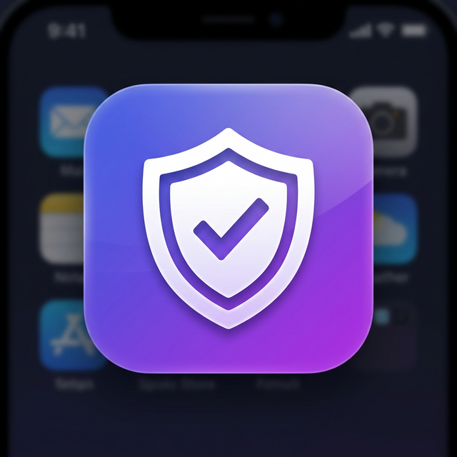
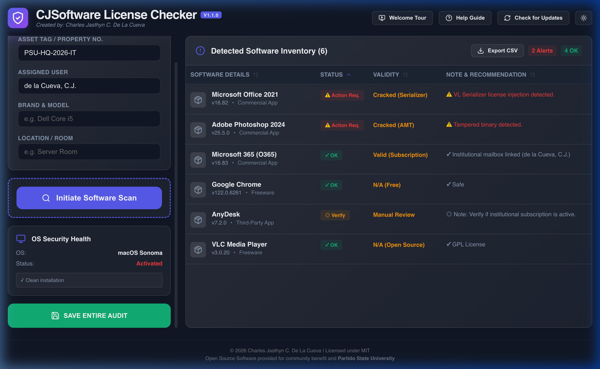

# 🛡️ CJSoftware License Checker

<p align="center">
  
  <br>
  <b>Industrial-Grade Software Auditing & Compliance Tool</b>
  <br>
  <i>An internal security tool for institutional software inventory and license verification.</i>
</p>

<p align="center">
  
  
  
</p>

---

## 📥 Download Latest Release

Get the latest stable version for your operating system. These links always point to the most recent release.

| Platform | Download Link | File Type |
| :--- | :--- | :--- |
| **🪟 Windows** | [**Download Installer**](https://github.com/selrahcDC/cjsoftware-license-checker/releases/latest/download/CJSoftware.License.Checker-Setup.exe) | `.exe` (Installer) |
| **🪟 Windows** | [**Download Portable**](https://github.com/selrahcDC/cjsoftware-license-checker/releases/latest/download/CJSoftware.License.Checker-Portable.exe) | `.exe` (Click-and-Run) |
| **🍎 macOS (Apple Silicon)** | [**Download DMG**](https://github.com/selrahcDC/cjsoftware-license-checker/releases/latest/download/CJSoftware.License.Checker-arm64.dmg) | `.dmg` (Universal) |
| **🍎 macOS (Intel)** | [**Download DMG**](https://github.com/selrahcDC/cjsoftware-license-checker/releases/latest/download/CJSoftware.License.Checker-x64.dmg) | `.dmg` (x64) |

---

## 📸 Snapshot


---

## ✨ Key Capabilities

### 🏢 Institutional Audit
*   **Deep Registry Scan**: Rapidly identifies installed software on Windows using optimized PowerShell queries.
*   **macOS Gatekeeper Analysis**: Verified integrity checks using `spctl` to detect unsigned or tampered applications.
*   **Multi-User Support**: Scans both system-wide and user-specific application directories.

### 🔐 Security & License Intelligence
*   **Cracked Software Detection**: Specialized modules to detect KMS crack tools, Adobe injection bypasses, and unauthorized license Serializers.
*   **Office Activation Diagnostics**: Institutional checks for Microsoft 365 Subscriptions vs. Perpetual Volume Licensing.
*   **Alternative Recommendations**: Automatically suggests FOSS (Free/Open Source) alternatives for non-compliant software.

### 📊 Enterprise Reporting
*   **SQLite Persistence**: Stores audit history locally for historical device tracking.
*   **Excel-Ready Export**: Generates professional CSV reports with institutional branding (Partido State University).
*   **Compliance Alerts**: Instant visual flagging of action-required items.

---

## 🛠️ Technical Foundation
*   **Core**: Electron
*   **Frontend**: React & Framer Motion (Glassmorphic Design)
*   **Styling**: Modern CSS Variables & Responsive Layouts
*   **Database**: Better-SQLite3
*   **Updates**: Integrated `electron-updater` system

---

## 🧑‍💻 Development

```bash
# Clone the repository
git clone https://github.com/selrahcDC/cjsoftware-license-checker.git

# Install dependencies
npm install

# Run in development mode
npm run dev

# Build production binaries
npm run build:mac  # For macOS
npm run build:win  # For Windows
```

---
<p align="center">
  <i>Authorized for use and utilization by <b>Partido State University</b>.</i>
</p>
